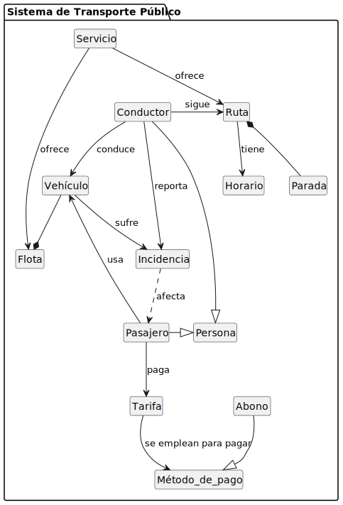
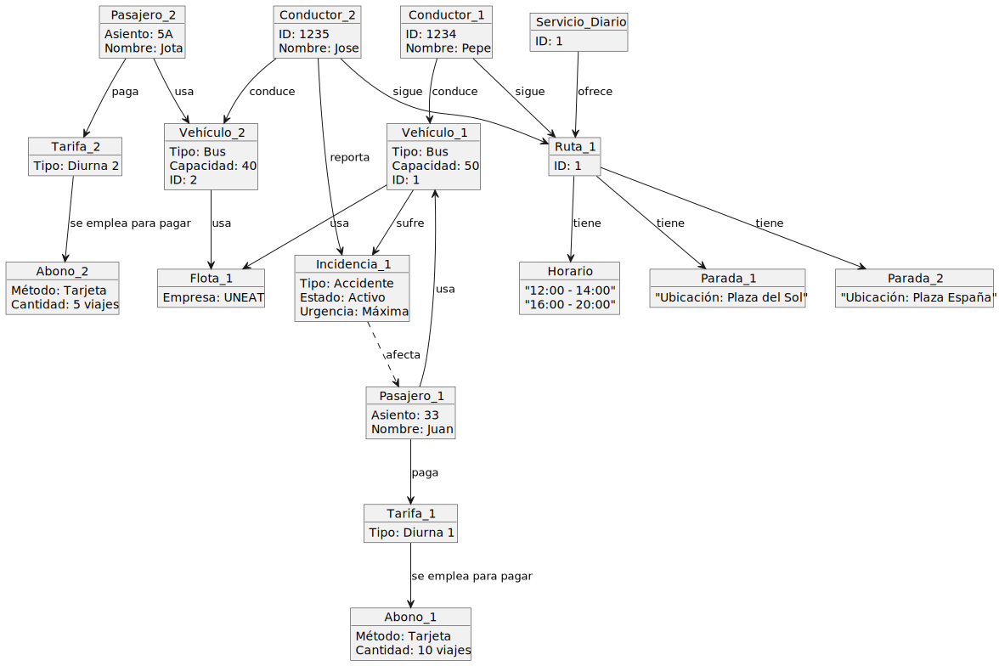
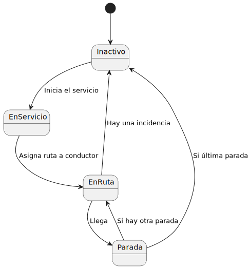

# ENTREGA POST PARCIAL IDSW1 2024

## [PDF Examen Parcial](documents/ExamenParcialIDSW2024.pdf)

## Diagramas originales y sus códigos

|Ejercicio|Codigo|Diagrama|
|-|-|:-:|
|1. Diagrama de clases| [Código](/modelosUML/ModeloDeDominioOriginal/DiagramaDeClasesOriginal.puml) |
|2. Diagrama de objetos|[Código](modelosUML/ModeloDeDominioOriginal/DiagramaDeObjetosOriginal.puml)|
|3. Diagrama Estados|[Código](modelosUML/ModeloDeDominioOriginal/DiagramaDeEstadosOriginal.puml)|

## Diagramas actualizados y sus códigos

|Ejercicio|Codigo|Diagrama|
|-|-|:-:|
|1. Diagrama de clases| [Código](modelosUML/ModeloDeDominioActualizado/DiagramaDeClasesActualizado.puml) |
|2. Diagrama de objetos|[Código](modelosUML/ModeloDeDominioOriginal/DiagramaDeObjetosActualizado.puml)|
|3. Diagrama Estados|[Código](modelosUML/ModeloDeDominioOriginal/DiagramaDeEstadosActualizado.puml)|

